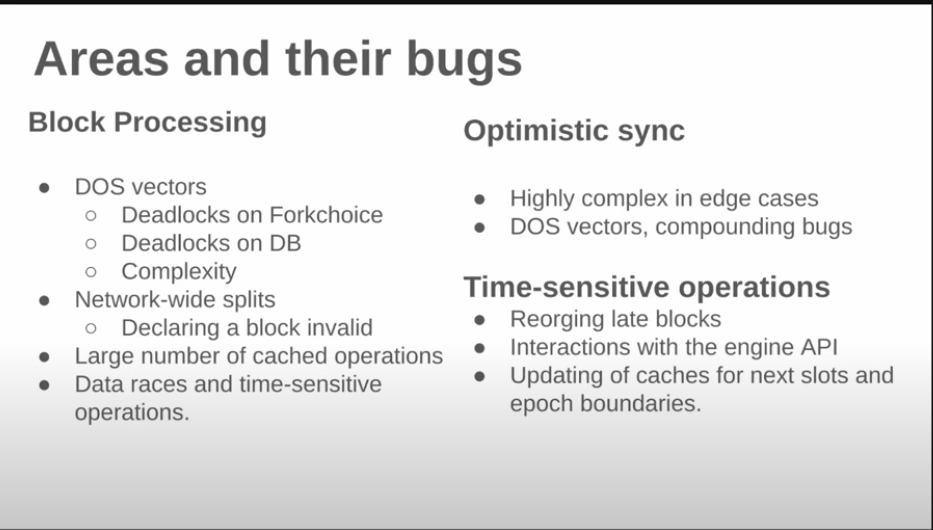

Day 2, more learning

PoS Attack and Defense

https://mirror.xyz/jmcook.eth/YqHargbVWVNRQqQpVpzrqEQ8IqwNUJDIpwRP7SS5FXs

https://ethereum.org/en/developers/docs/consensus-mechanisms/pos/attack-and-defense/

Layer 0 Attacks

- basically attack the people (developers) etc, making them quit their jobs or something
- or maybe spread false information about Ethereum

30% attack? 

https://arxiv.org/pdf/2102.02247

1 Block reorg attack?

https://notes.ethereum.org/plgVdz-ORe-fGjK06BZ_3A#Fork-choice-by-block-slot-pair

Balancing attack?

Don't really understand this attack so far

- block proposer propose 2 blocks, give half to honest validators and the other half to other honest validators

Question: what is "give half"? Actually what happens when a user propose 2 blocks lol, since a validator can only attest to one block. 

What if the proposed block is wrong? What happens? Or both blocks are wrong? Or what if the block proposer proposed like 1000 blocks? lol

- I think what happens is both the proposed blocks are correct
- But the validators can only attest to one correct block
- Then the chain will split and both blocks will continue being proposed, but neither can reach a supermajority to finalize
- The other malicious validators just do not participate.

Or there's another attack called bouncing attack, similar but the malicious validators just attest to different blocks on different forks, bouncing around

Consensus

Teku: Written in Java.
Lodestar: Written in TypeScript.
Prysm: Written in Go (Golang).
Nimbus: Written in Nim.
Lighthouse: Written in Rust.
Nethermind: Written in C#.

I don't have experience in any... probably try prysm first ig...

update: there's like 0 resources on youtube except the immunefi one, good luck

https://docs.prylabs.network/docs/advanced/beacon_node_api

Not sure what goes on here

https://www.youtube.com/watch?v=2_Z36i5_vtY&t=1022s

Interesting checklist to set up a validator

https://launchpad.ethereum.org/en/checklist

Amount of Active Validators as of 5/1 -> 1.063M

https://beaconcha.in/

Missed Block: (penalty)

https://beaconcha.in/slot/10765872

Looks like in a missed block, the blocks just gets propsed again by another proposer, probably waste time but nothing else

every block is 12 seconds, if a block is missed, then wait another 12 seconds

notice how 2 epoch before it's "justified", but after that its finalized